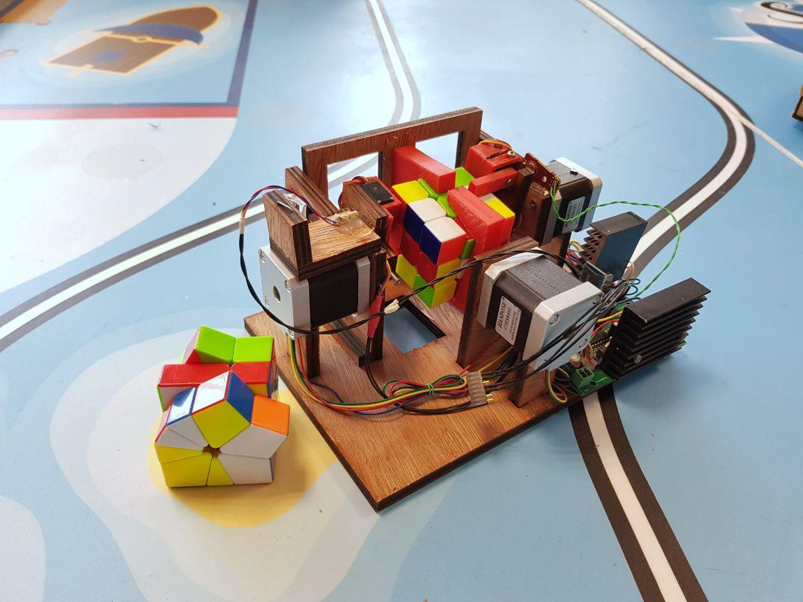

## <i class="fas fa-trophy"></i> La coupe de France - édition 2020
Préparez vous à prendre le large ! En 2020, les robots partiront voguer à
travers le monde. Ils devront maîtriser l'art de la navigation afin d'arriver à
bon port. Les phares et les balises orienteront vos navires. Planifiez votre
voyage et rapportez le récit de vos aventures. Souquez ferme, moussaillon !
 ![table2020]Cette année nos missions sont
+ Créer des chenaux pour rétablir la circulation maritime
+ Relever les manches à air qui ont été balayées par la tempête
+ Allumer le phare pour que les bateaux égarés puissent rentrer au port en toute
  sécurité
+ Arriver à bon port, afin de mettre les robots au mouillage, à l'abri du vent,
  à la fin de leurs voyages
+ Hisser nos pavillons pour transmettre des messages aux autres navires
+ Estimer nos performances

[table2020]:assets/images/table2020.png
{:class="image about center"}
### Eirbot - Equipe 2A
#### <i class="fas fa-robot"></i> Robot

#### <i class="fas fa-flask"></i> Expérience (Phare)

### Eirboat - Equipe 1A

#### <i class="fas fa-robot"></i> Robot
![1A2020robot]Cette année Eirbot mise sur la qualité plutôt que la quantité : le robot
autonome aura pour objectif de faire avec précision les actions qu'il
entreprendra. L'objectif sera alors de construire et réactiver le phare, de
redresser les manches à air et de retourner à bon port après avoir décodé la
boussole. Les plans de notre robot ont été réalisés. Ils ont pu devnir concrets
grâce à la découpeuse lasr du FabLab de l'Enseirb et à notre imprimante 3D. Les
cartes électroniques ont été réalisés par nos soins à l'ENSEIRB.

[1A2020robot]:/assets/images/1A2020.png
{:class="image about right"}
#### <i class="fas fa-flask"></i> Expérience (Phare)
Cette année l'expérience à réaliser est un phare, il doit respecter les
contraintes suivantes
+ faire moins de 3 kilogrammes
+ faire moins de 30 cm de haut éteint
+ faire plus de 70 cm de haut allumé
+ il devra balayer une zone soit circulaire soit faire des allés retour sur un
demi cercle
Nous avons alors opté pour un bras robotique imprimé en 3D. 

<!-- en attente de mise à disposition sur youtube <iframe src="/assets/phare.mpeg" width="100%" frameborder="0" allowfullscreen></iframe> -->
##  <i class="fab fa-leanpub"></i> Projets 1A
Chaque année des nouveaux arrivent, nous leurs proposons alors de réaliser des
petits projets leurs permettant de s'initier à la robotiques et aux divers
outils que propose l'ENSEIRB.

### 2019 
Nous avons lancé 5 projets
(recoder le panneau d'entrée, un table apéritif, une useless box, un robot
suiveur de ligne et un snake 3D), 4 d'entre eux ont abouti à quelque chose.
{:class="image about center"}
{:class="image about center"}
{:class="image about center"}
{:class="image about center"}

## Projets antérieurs
### <i class="fas fa-trophy"></i> Coupe de France - édition 2019
Il y a 150 ans, Dimitri Mendeleïev revolutionnait notre compréhension de la
matière et faisait faire un pas de géant à la science en publiant ses travaux
sur la classification des élements. Graĉe à son célèbre tableau, il a supposé
l'existence d'atomes inconnus et a donc laissé des cases vides. quelques
nouveaux atomes seulement ont été découverts depuis , validant par la même
occasion les travaux de Dimitri Mendeleïev ! Au dela des éléments connus, il y
en a toujours que nous ne connaissons pas. Découvrir des atomes peut être une
tâche difficile et requiert souvent des expériences complexes.

![table2019] En 2019, nous avons été appelé à l'aide pour réaliser ces expériences ! Nos
missions étaient
+ Classer les atomes. Comme dans le tableau périodique des éléments
+ Peser les atomes. Car souvent les plus rares sont les plus lourds
+ Créer un nouvel élément. Et pour cela rien ne vaut un bon accélérateur de
  particules
+ Faire votre propre expérience. Libre à nous de proposer une expérience de
  notre créaion
+ Prédire les éléments non connus. Tout comme Dimitri Mendeleïev a su prédire la
  position des éléments inconnus, il nous faudra faire une prédiction. Notre
  score par exemple ! 

[table2019]:/assets/images/table2019.png
{:class="image about center"}

  Comme chaque année nous avons comme chaque année mis en place 2 équipes, les
  1A et les 2A.
 

  
#### Eirbot - Equipe 2A - 29/143

{:class="image about center"}
{:class="image about center"}

#### Eirb'ium - Equipe 1A - 108/143

{:class="image about center"}
{:class="image about center"}
  

### <i class="fas fa-car"></i> Brenda & Criquette
Deux voitures télécommandées, basées sur le principe de RocketLeague ont été
constuire, leurs doux sont Brenda & Criquette et cela nous a permis de
tester la technique du pliage du bois grâce à la découpeuse laser du FabLab
{:class="image about center"}

### <i class="fas fa-cube"></i> Solveur de Rubik's cube
Un projet concluant de Vincent (promotion 2020) qui permettait de résoudre un
Rubik's Cube cubique, ou avec une forme plus originale, le tout en t secondes !
{:class="image about center"}

### Projets en vrac
